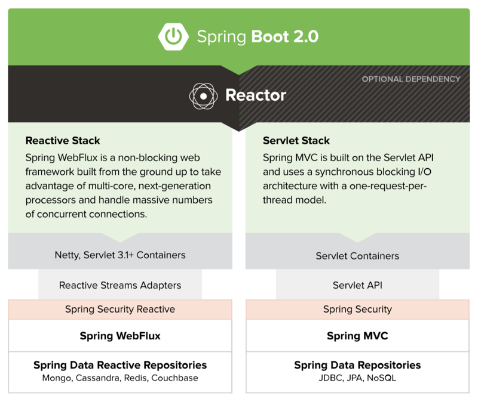

## 0101. 初识 Spring

### 1.1 大纲

1、初识 Spring：1）Spring 家族的主要成员。2）跟着 Spring 了解技术趋势。3）编写第一个 Spring 应用程序。

2、数据操作。1）JDBC 必知必会。2）O/R Mapping 实践。3）NoSQL 实践。4）数据访问进阶。

3、Web 开发。1）Spring MVC。2）Web 开发进阶。3）访问 Web 资源。这一部分里回去聊，RESTful Web Service 相关的内容，还有在 Spring 5 出现的 WebFlux 相关的东西，还有分布式 Session。

4、Spring Boot。1）自动配置原理及实现。2）起步依赖原理及定制。3）配置文件加载机制。4）获取运行状态。5）配置运行容器。6）可执行 Jar 背后的秘密。这一大部分里会去聊 Starter Dependancy，还有有它的一些自动配置是怎样实现的。也会聊一聊在 Spring Boot 中运维的一些点它是怎样考虑的。

5、Spring Cloud。1）云原生和微服务。2）服务注册、发现、熔断与配置。3）Spring Cloud Stream。4）服务链路追踪。这一部分会去聊它的服务发现、服务注册、还有熔断。

### 1.2 Spring 家族主要成员

1、诞生于 2002 年，成型于 2003 年，最早的作者为 Rod Johnson。

Expert One-on-one J2EE Design and Development

Expert One-on-one J2EE Development without EJB

2、目前已经发展到了 Spring5x 版本，支持 JDK8-11 及 Java EE8。

Spring 始于框架，但不限于框架。1）Spring Framework。2）Spring 相关项目。比如 Spring Data、Spring Boot、Spring Cloud，以及你可能不太熟悉的 Spring Social、Spring Kafka。3）整个 Spring 家族。

Spring Framework：用于构建企业级应用的轻量级一站式解決方案。

设计理念：1）力争让选择无处不在。2）体现海纳百川的精神。3）保持向后兼容性。4）专注 API 设计。5）追求严苛的代码质量。

Spring Framework


Spring Framework 非常着重的突出一个分层的设计，它争取在每一个层都让你有自己的选择，比方说我再旁边图上可以看到它的数据访问层，你可以选择 JDBC 也可以选择 ORM 这样的方式。另外，在这个层里面，我们选择了 ORM，Spring 也可以说你可以去用 Hibernate，也可以选择 iBatis 或者 Mybatis 这样的框架。所以说它其实把所有能够想到的这些主流的研发框架和这些工具支持都已经考虑在里面了。你完全可以说在选择时不必有心理负担，选择你熟悉的、选择你最好用的那个，Spring 一定会提供对它的支持。然后 Spring 也保持了一个非常好的向后兼容性，也有一个非常好的 API 的设计。这里要着重说一下 Sping 的核心的那些代码。其实在这么多年来说并没有一个太大的改变，比如说他的 IOC、它的 AOP 这样的一些部分，所以说这是一个非常厉害的地方。

最后是它的代码质量，Spring 的代码如果大家去它的 GitHub 上看，会发现其代码是非常整洁的，尤其是他的 JavaDoc 也非常的完备。我们会看到它的 JavaDoc 部分里，每一个类上面都会有很多的东西，写的非常清楚它是干什么的，在这一点上其实也非常值得大家去学习。

Spring Boot



Spring Boot：快速构建基于 Spring 的应⽤程序。1）快、很快、⾮常快。2）进可开箱即⽤，退可按需改动。3）提供各种⾮功能特性。4）不⽤⽣成代码，没有 XML 配置。

在本课程中，你还会看到：Spring Data、Spring MVC、Spring WebFlux……

目前很热的一个框架，它帮助大家用最少的时间和精力去构建一个基于 Spring 的应用程序，如果你对 Spring 的历史有一定的了解，或者说使用的时间比较长的话，你会知道还有一个叫 Spring Roo 的一个工具，它是帮助大家去生成那些 Spring 的骨架、它的代码、它的各个层的这样一个工具，那么现在 Spring Roo 已经慢慢被 Sping Boot 所淘汰掉了。在他们的理念中，如果这个东西是可以被生成的，那么它的存在价值就没有那么大，因为我可以把这些生成的东西去掉，囊括在代码里面，让框架来给你做这些事情，所以说 Spring Boot 的诞生也是一种开发趋势的改变。Spring Boot 里面提供了很多开箱即用的功能，比如说你从 start.spring.io 上面可以直接去下载一个骨架的程序，直接就能运行，它里面包括你需要的应用容器等等一系列的东西，然后如果你里面引入了数据库的连接的一个驱动，比如说 H2，比如说 MySQL，然后引入 JDBC 支持，它自动会帮你配置好相关的设置，这一点完全可以做到开箱即用。同时它也给你留了很多配置的空间，你可以完全去做你自己的定制，然后在 Spring 当中其实还有很多非功能性的东西，比如说它里面的安全性考虑了很多东西，它里面的监控替你考虑了很多东西，那么其实在平时的应用开发过程中，大家可能更多的去关注一个应用逻辑的实现，而且这些非功能性的考量可能并不足。Spring Boot 其实把业内的很多最佳实践都放到框架里面，让你可以更多的 focus on 你的业务逻辑上，而不用关心这些非功能性的点。

最后，即使我前面讲的，它不太需要去生成各种各样的东西了。在这个课程中，我们在 Spring Boot 的使用过程中也会去讲到它相关的 Spring Data、SpringMVC、Spring WebFlux 这样等等一系列的东西。

Spring Cloud


Spring Cloud：1）简化分布式系统的开发。2）配置管理。3）服务注册与发现。4）熔断。5）服务追踪。……

Spring Cloud 也是这几年诞生的比较热门的 Spring 成员，在里面它其实帮大家简化了分布式系统的开发，比方说我在分布式系统当中的服务注册和发现怎么去做，我的整个配置管理怎么去做，我的服务的熔断该怎么去做，那么在整个应用程序从单机向集群向发展的过程当中，Spring Cloud 帮助大家能够能快更好更轻松的去开发出一套基于云的应用程序。

#### 黑板墙

作品中会有提到如何启动后动态初始化 spring bean嘛？作者回复：如果你说的是 Spring Boot 怎么做自动配置的，那在 Spring Boot 的自动配置相关的章节里会提到，如果你是说怎么做后置处理，有关于 Spring 的 BeanPostProcessor 和 BeanFactoryPostProcessor 的内容，在讲如何在 3.x 上实现自动配置时会讲到。如果你说的是如何动态创建 Bean，那在第 3 章讲 Repository 的创建时会提到。2019-02-12

作为一个前端开发者对 java 还没有那么的熟练，今年准备好好系统的学习下 Java 还有 Spring 全家桶的东西，除了您这个全家桶的视频，还有没有推荐的书籍呢？作者回复：《Spring实战》是大家看的比较多的，而且已经第五版了，可以考虑看看。另外，其实我更推荐看官方文档来学习。2020-04-13

Spring 的学习需要事先学习掌握 struts、jsp 等知识吗？作者回复：这倒是不需要，而且 Struts 现在也用的少。2019-02-27

有时间能否评价一下 spring cloud alibaba，及使用趋势。作者回复：Spring Cloud Alibaba 还是提供了不少阿里的实践经验的，这些设施还是经过考验的，但后续如果发展我不好评价，美好的愿望是其中的项目能发展为类似 Apache 顶级项目吧，只是愿望，不知道阿里的团队能不能坚持把这些开源项目维护下去。2019-02-20

如何高效的阅读源码，哪些部分的源码是一个开发者必须掌握的，哪些框架中的设计模式，会在实战中经常运用，AOP 的实战场景可以介绍下吗？作者回复：如果只是用代码做开发，其实完全可以不用看源码，阅读源码是帮你更好地掌握框架，在遇到问题时能更快地找到解决的思路。不用一下子想着把所有内容都读了，其实我也没把所有代码都看了，我是随着自己的使用在分段地阅读，自己用到了或者需要稍微改动一些东西时（后者不常见，除非你专门是做这个的），去读会更有效果。至于 AOP，其实 Spring 的事务就是基于 AOP 做的，还有通用的统一摘要日志等等。2019-02-12

我知道 Spring Cloud 主要搭建 rest 的 http 应用，在最后 Spring Cloud 图中显示，Web、iot、mobile 通过 api-gateway 访问系统，Spring Cloud 是不是支持出 http 以外的协议呢？Spring Cloud 是不是可以和 netty 结合呢？作者回复：这里的 Gateway 其实是指 Spring Cloud Gateway，之前也有用 Netflix 的 Zuul 的，但也是以 HTTP 形式居多的。你问可不可以与 Netty 结合，我只能说，只要想，总是有办法的，用 Spring Boot 写个程序里面用 Netty 启动监听个端口也是中方式，不是么，其实 WebFlux 就支持 Netty。但你说的官方是否支持非 HTTP 协议的网关，走 TCP 的，这个我的确没见到过。2019-02-20

### 1.3 跟着 Spring 了解技术趋势

不知道有多少同学回去看一些框架的 Release Notes，它的 Changelog 等等这样的一些信息。比方说我们可以看一下 Spring Framework 5.0 的它的一个 Release Notes，这里面我摘出了这么一些东西。

| 改变点 | 改变的意义 | 一些思考 |
| --- | --- | --- |
| Java 8+、Kotlin | 语⾔⻋车轮滚滚向前 | 还在⽤低版本的 Java 我该怎么办 |
| WebFlux | 异步编程模式的崛起 | 全⾯落地尚需时⽇ |
| 去掉了很多⽀持 | Portlet 过时了、Velocity 不维护了、 JasperReport 不流⾏了 | 库有千千万，我该怎么选？ |

关注语言新版本里的一些新特性，比如 Java 8 里的 lamba。

开始支持 Kotlin 了，这门语言既然得到了 Google 的支持，然后也得到了 Spring 的支持，那么说明至少我去了解一些它，也许它会给你带来一些新的思路。

第二个是开始支持 WebFlux 了，在这里可以体现出：同步的编程模式大家都熟悉了，异步的整个编程模式，其实在 Java 这边之前可能不像 JS，我们有 Node.js 那时候就开始异步，但在 Java 里面其实我们还是有的慢一拍的。随着 WebFlux 的一个流行，它的一个支持，我们也可以看到异步在 Java 当中的落体。由于种种原因，它的一个全面的落地可能还需要一定时间，但是从这个点开始，你已经可以去关注在 Java 当中的异步编程模式了。

第三条其实是 Spring 里面去掉了很多的一些框架和工具的支持，比如我们以前在 Spring 里面会看到有 SpringMVC 也有 Spring Portlet，那么现在的话整个的 Portlet 部分就被去掉了，也可以发现其实现在越来越少的那些人在写 Portlet 了。另外是去掉了 Velocity 的支持，以前我们看到框架中会支持 FreeMarket、Velocity 这样的模板引擎，看到这一条的时候我还有些惊讶，因为我之前就是有 Velocity 的，我去 Velocity 官网也去查了一下，这个 Velocity 已经很久没有维护了。但近期它突然更新了一版，但也是一个属于维护性质的更新。现在如果你还要选择模板的话，可以选择那些更加活跃的引擎。第 3 个其实是像去掉了 JasperReport 这样的一些支持，以前我们可以说去做一些水晶报表，然后用 JasperReport 去做一些报表这样的东西，现在其实 JS 语言也非常强大了，可以看到越来越多的这种报表工具，图表的框架都是全端去做的，像百度的 ECharts 这样的一些 JS 工具。而后端的程序只需要说提供相应的数据就可以了，说明这也是一种开发趋势。所以说大家在选择自己用的各个层的类库时，可以更多的去考察一下这个社区是不是活跃的，是不是一直在维护，它的使用人群是什么样的。通过这样的一些办法，然后再结合我们看一下这些主流的框架，对这个工具的支持，通过这些可以判断出来，我是不是该选择这样一个工具。

我们前面讲的是从 Spring Framework 的 Realease Notes 看出来行业的趋势，接下来其实这两年 Spring 的重点可能更多的关注在 Spring Boot 和 Spring Cloud 上，我们看下通过这个图又能看出什么。

Spring 刚诞生的时候，其实我们可以看到关注 EJB 跟关注 Spring Framework 的人其实差不多，随着时间发展，EJB 的热度在慢慢下降，Spring Framework 的热度也在下降，因为大家把更多的注意力放到了 Spring Boot 和 Spring Cloud 上。这是为啥呢？

Spring Boot 和 Spring Cloud 的出现是必然的：1）开箱即⽤。2）与⽣态圈的深度整合。3）注重运维。4）Cloud Native的⼤⽅向。5）最佳实践不嫌多，固化到系统实现中才是王道。

首先当然是因为大家在开发的过程中有了更多的想法，我们对这种业务逻辑之外的非功能性的要求有了更多的认识。既然大家都希望去实现那些公共的非功能性的东西，希望简化自己的研发，那么 Spring Boot 就为大家做了各种各样的考虑，使用它的话你可以大大降低自己在非功能性上所投入的时间，然后另外是我们的 Spring Boot、Spring Cloud 它都和它的生态有一个非常紧密的整合。比如说，Spring Cloud 里面，我们就会有整个的对 Netflix 套件的支持，我们有对 ZK 的支持，我们有对 Consul 的支持，我们有对各种各样的，包括阿里云的一个支持，那么我们会有一套 Spring Cloud 的阿里巴巴的一套支持等等。大家都会把自己的一些最佳实践，通过各种各样的方式整合进来。

然后我们也在运维上面，随着从单机到集群到云这么一个变化，更多的考量的点也慢慢的从说我自己怎么样去弄，跑自己的程序保证它不挂，到变成我这应用服务器的整个物理机的宕机是一个常态，我怎么样保持我的应用在各种各样故障的情况下，能够快速的恢复，快速的降级，这些慢慢的都变成大家的常识。Spring Cloud 的出现其实是帮大家把这些常识和这些最佳实践，固化到框架当中去，让你可以非常轻松的去实现出一套非常说有高可用的一个应用程序。

另外，整个的 Spring 我们最早它就是把整个的最佳实践囊括到了这个框架当中去，Spring Boot、Spring Cloud 它其实非常好的继承了这个光荣的传统，在里面我们可以看到更多的一些与运维还有部署相关的最佳实践，比如说我们怎么样从一个外置的应用容器变成内嵌式的应用容器，我们怎么样去监控应用程序的运行状态，我们怎么样去管理自己的配置文件，我的配置文件整个的覆盖的规则会是什么样的。当然也包括了我怎么样去做熔断，怎么样去做服务的发现与注册，这样的一些点，他都替你考虑到了。所以说，今后的开发你不会是与单独的 Spring Framework 去打交道，更多的你是在和 Spring Boot、Spring Cloud 以及整个 Spring 的家族打交道。

#### 黑板墙

Java 学到什么程度才可以开始着手学习这套视频？作者回复：我想会基本的语法，了解常用的包和库，会用 Maven，对 DB 和 Web 的东西再有点了解，应该就差不多了吧。2019-02-11

我看到现在 github 上有很多基于 spring-boot 和 spring-cloud 的开源项目，很多评价都很高，但 clone 下来后有一种不知从何开始的感觉。能否推荐一个合适的项目，按贵课的划分介绍下如何从大到小入手拆分和查看一个 spring-boot/cloud 项目，相信这对于 Spring 的各个分层和架构的理解都有好处。作者回复：我觉得江南白衣的 SpringSide 就是个很好的例子吧，用到了大量 Spring 的特性。2019-02-18

用 Velocity 好久了，也是前段时间才注意到好久没更新了。那么，老师，有什么其他模版引擎推荐嘛？还是说提倡前后端分离呢？作者回复：做页面的话 Thymeleaf 好像出镜率比较高。但我觉得前后端分离是趋势，还是让专业的人做专业的事吧。2019-02-13

我们还是 Spring3.x，新的估计组内都没人研究，即使研究了 leader 也不敢上，系统太核心以稳为主。作者回复：你也不会一辈子待在一个地方不是么，组里的核心系统不用，和你学不学也没什么必然关系，既然以后你在别处会用上，那为什么不学呢。你说对不？2019-09-16

问一下从集群到云的变化，主要体现在哪些方面呢，是抽取配置公共化嘛。作者回复：并不是，很多时候是看待系统设计和运维时思想上的变化。2019-02-13

dubbo 与 springcloud 都有解决服务间通信的问题吧，应该有很多相似的吧。作者回复：两个不是一个层面上的东西。2019-02-20

jasperReport 好用啊，为什么不支持了。有什么更好了的推荐吗？作者回复：官方的文档是这么说的：Dropped support: Portlet, Velocity, JasperReports, XMLBeans, JDO, Guava. Recommendation: Stay on Spring Framework 4.3.x for those if needed. 我个人理解现在大前端，前后端分离是趋势，前端有很多不错的框架来支持报表，后端提供数据就好了。另外，我通过 Google Trends 也看了 JasperReports 的趋势，全球范围内，从 2005 后它的热度就一直在下降，Spring MVC 和 WebFLux 要同时去支持这么一个框架成本也挺高的。如果一定要使用它，使用 Spring 4.x 就好。话说现在很多 to B 的系统还在使用 Spring 3.x 的框架呢……2019-02-11

应用从集群到云的改变在开发的时候有哪些不同。作者回复：说到这个，可以去关注下 Cloud Native 云原生应用，这里就有了些不同的想法和实践，感兴趣的话，可以了解下 12-Factor App。2019-02-11

spring cloud 相对 dubble 的优势是什么，看到文章说 dubble 性能是 spring cloud 的三倍。作者回复：你说的是 Dubbo 吧，他们不是一个层面上的东西，Dubbo 解决的是 RPC 的问题（它现在也有 REST 的支持），自带了服务注册、负载均衡等功能，而 Spring Cloud 涉及的面要更广，而且各个层面上的选择会更广。所以没必要把它们放一起比。2019-02-12

servlet -> spring&SpringMVC -> spring boot -> spring cloud 确实能看到老师所说的开箱即用和与生态圈深度整合的体现，但是我有一个疑问，想把 spring 学好、学深，从其中任何一个阶段都可以吗？还是说需要从 servlet 开始深入研究。作者回复：我觉得哪里开始都行吧，但最终你为了把一些点搞明白时都会深入进去，那时你早晚会接触到 Servlet 等等内容的。2019-09-07

模板引擎可以用 Thymeleaf，目前更新很快，维护良好。作者回复: Web 页面的模板引擎是的，不过我现在看到更多的是前后端分离，前端都前端同学做了，后端提供接口，直接给数据。当然，一些后台系统还是直接写了，不用都拆这么清楚。2019-02-12

Thymeleaf 和 FreeMarker 当如何取舍？作者回复：我以前还在用 Velocity 呢，现在都没它什么事了，现在的话我会选 FreeMarker，相比 Thymeleaf 更老牌，更成熟，Thymeleaf 感觉更适合做 Web，FreeMarker 不仅适合 Web，也适用其他场景。仅供参考，也许这只是我不思进取，没跟上潮流……2019-03-24

想问一下 Grails 和 springboot 对比如何，是否值得去学习，在开发中您或者您的团队有使用 Grails 开发吗？作者回复: Grails 用的是 Groovy，感觉相比 Java，Groovy 用的不多，但学习一门脚本语言还是有必要的，可以帮你拓展下思路。2019-02-24

应用如果需要上云，需要进行什么特殊的改进吗？作者回复：其实应该反过来思考，就算我只是部署在自己的 IDC 里，我应该怎么借鉴云的思想，来优化我的应用。2019-02-12

一千万条以上的（10g 左右）的 excel 报表能在前端生成吗，有没有办法加快速度啊。作者回复：前端是指浏览器么？通常这种大批量数据的生成，不都放在服务端生成完了，然后让前端再来取么。2020-09-24

一直都没弄明白 springboot, 连基本的框架都搭不明白，用 springboot 不用知道太多，真的是好用。作者回复：正好可以趁这个机会弄弄明白哈。2020-03-22

Spring 集成 Netty 主要需要为了提供啥功能？作者回复: Spring 最基础的功能（比如 Context 这些）是不需要 Netty 的，你可以看看是哪个模块依赖了 Netty。2020-03-20

现在还在使用 Java8，是不是需要考虑使用 Java11 了。作者回复：是的，现在 14 都已经出来了，建议使用 8 11 这样的 LTS 版本，其他的版本要了解一下新的变动。2020-03-20

我想问一下，现在一线的互联网公司，架构都替换成 springboot 了吗？还是说开源加公司自己定制化呢。作者回复：一般都会选择 Spring Boot，但多少都会在上面做一些与公司内部设施、规范或者其他东西相关的封装，有自己内部的设施，也会做一些自动配置等等的功能。2020-02-26

动态的多数据源，怎样合理设置，根据数据源配置，在容器中注入，怎么合理化及时的更新，如何实现优化，当前我已经实现一部分，但是感觉不健康。作者回复：关于这个话题，你可以看一下我们的第一次课程答疑，聊了一些这方面的话题。2019-04-13

springboot 中如果一个 http 接口在收到客户端用户的 http 请求之后需要查询内部的十多个 Python 的接口服务，然后汇总结果后返回给客户端。请问下是怎么做呢？作者回复：Java 调用 Python 发布的 HTTP 接口，不要直接调 Python 的程序，取到结果后返回。这里如果没有接口依赖顺序，这十多个接口可以用多线程去调用，缩短时间。不过你的依赖这么多，一定要考虑失败的情况。2019-02-19

spring framework、spring boot 和 spring cloud 这三者之间是什么关系？是后者可以替代掉前者吗？作者回复：不是，Spring Framework 是基础，后者建立在前者的基础之上。2019-02-17

spring-cloud-Netflix 进入维护期，后面会讲 spring-cloud-alibaba 吗？作者回复：在 Spring Cloud 的章节里会有 Netflix 以外的东西的，当然也会有包含一些 Spring Cloud Alibaba 的东西，可以去看看大纲哦。2019-02-16

课程中可以聊聊关于分布式 session 的实现吗？作者回复：在讲 Web 进阶的章节中会有聊到分布式 Session 的话题。2019-02-12

请问配置环境以及搭建框架有教程吗？作者回复：额，这个我好像也没怎么搭环境，我就装了个 JDK，然后装了个 IDEA 的 IDE，再下了个 Maven，就没有了，如果不自己装 Maven，就用 IDEA 自带的。2019-02-12

### 1.4 编写你的第一个 Spring 程序

Hello Spring

基本步骤：1）通过 Spring Initializr ⽣成⻣骨架。2）编写第⼀段代码。3）运⾏你的程序。4）分析项⽬结构。

用 start.spring.io 去初始化你的第一个小程序，写一段最基本的 Hello World 代码，同时跟你解读一下 Spring 生成的骨架它是什么样的，它的 pom.xml 里写了什么。同时如果我不用 Spring 生成的骨架，我自己可以去怎样修改我的 pom 文件。

项⽬结构

⾃动⽣成的 Maven ⼯程：1）pom.xml。2）包含 main ⽅法的 Java 程序。3）测试类。4）配置⽂件。

pom.xml ⽂件解读

依赖 spring-boot-starter-parent：1）⽅便快捷。2）⾃动引⼊ spring-boot-dependencies。3）⾃动配置 spring-boot-maven-plugin。

[Spring Initializr](https://start.spring.io/) 上面选择配置。

Project => Maven Project

Language => Java

右边的依赖搜关键词 web 选择 Spring Web，搜关键词 actuator 选择 Spring Boot Actuato，点击左下角的「Generate」产生一个项目文件。用 Idea 打开后会自动下载相关的依赖文件。这里折腾了一段时间，好在解决了，顺便也跑通了一个用 Gradle 生成的项目。

修改相关代码：

```java
package dalong.spring.helloworld.demo;

import org.springframework.boot.SpringApplication;
import org.springframework.boot.autoconfigure.SpringBootApplication;
import org.springframework.web.bind.annotation.RequestMapping;
import org.springframework.web.bind.annotation.RestController;

@SpringBootApplication
@RestController
public class DemoApplication {

	public static void main(String[] args) {
		SpringApplication.run(DemoApplication.class, args);
	}
	@RequestMapping("/hello")
	public String hello() {
		return "Hello Spring";
	}
}
```

点击 Run 后跑起来，没问题。随便在项目文件夹下打开一个终端，输入命名：

```java
curl http://localhost:8080/hello
```
 
因为在建项目包的时候选择了 Acuator，那么它还为我们提供了了额外的功能，输入命令：

```java
http://localhost:8080/actuator/health
```

比如说这个情况检查，它可以告诉我当前这个应用程序的状态是 ok 的还是不 ok 的，这边看到的是 up，ok 的。如果有问题的话它就是 down，甚至说可能整个应用系统都没有成功。那么这个时候我们访问健康检查的 URL 的话就是失败的。

回过头来，我们看一下，既然我们选择的是一个 Maven 的工具，所以 Spring Boot 给我们生成了一个 Maven 的 pom 文件。

```java
	<parent>
		<groupId>org.springframework.boot</groupId>
		<artifactId>spring-boot-starter-parent</artifactId>
		<version>2.4.5</version>
		<relativePath/> <!-- lookup parent from repository -->
	</parent>
```

一上来，Spring Boot 把它的 Spring Boot start parent 作为我们真个 Maven 工程的 parent 引入了进来。在这个里面它其实定义了大量的依赖，Spring 官方其实对这些依赖都进行了严格的测试，能保证它们是没有冲突的。所以我们在下面使用的时候会看到，我们并没有指定版本号，我们只是告诉了 Maven，我需要依赖什么，剩下的版本号都是在整个 parent 当中的 dependencyManagement 里面去管理的。

```java
	<dependencies>
		<dependency>
			<groupId>org.springframework.boot</groupId>
			<artifactId>spring-boot-starter-actuator</artifactId>
		</dependency>
		<dependency>
			<groupId>org.springframework.boot</groupId>
			<artifactId>spring-boot-starter-web</artifactId>
		</dependency>

		<dependency>
			<groupId>org.springframework.boot</groupId>
			<artifactId>spring-boot-starter-test</artifactId>
			<scope>test</scope>
		</dependency>
	</dependencies>
```

然后这里我们还定义了一个 Spring Boot Maven plugin，这个 plugin 其实就是在我们执行项目打包的过程中，它会替我们生成一个可执行的 jar 包。

我们简单演示一下。 

```java
mvn clean package -Dmaven.test.skip

cd target
```

1『

用了上面的命令发现打包不了：

```
zsh: command not found: mvn
```

解决方案：[IntelliJ & Maven - mvn command not found - Stack Overflow](https://stackoverflow.com/questions/36105004/intellij-maven-mvn-command-not-found)

直接点开右侧的 Maven 面板：demo => Lifecycle => Package，点 Run。

』

在 target 中我们可以看到有两个 hello spring 的 jar 包，生成的最原始的包只有 3.1K，而我们实际使用的包它有 17M。为啥有这么大的差距，那是因为 Spring Boot 在打包的时候，它帮我们把所有的依赖都放到了 jar 包里。这个 jar 包是个可执行的 jar 包。

把跑的程序停掉，我们可以来看一下，我们直接在终端里运行这个架包：

```
java -jar hello-spring-0.0.1-SNAPSHOT.jar
```

通过简单的 `java -jar` 就可以我们就可以执行这个程序，它同样也是在我们的 8080 端口上面启动了一个 Tomcat，其功能是一样的。而这个架包是一个可执行的架包。这也就意味着，我们的整个 hello world 的程序，能够作为一个单独的进程运行着，和其他的那些程序完全是一样的，它不需要一个外置的容器。

你可能还有另外一个疑问，如果我的工程由于某种特定的原因，它一定要有自己的 parent，不能使用 Spring Boot start parent 作为我们的 parent，那么该怎么办？Spring 官方其实早就想好了应对的办法，只需简单的修改一下 pom 文件就能实现这个目标。

来看一下这个 pom 文件，在这个文件里我没有指定 parent，但是我在这里声明了一个 dependencyManagement，在其中我把 Spring Boot 的依赖，完整的 import 进来，通过这个方式，我们同样可以实现 parent 所做的依赖管理的功能。同样的，我们下面还是会保留整个的 Spring Boot Maven plugin，但是我需要指定的是它在 repackage 的这个时候介入进来的。