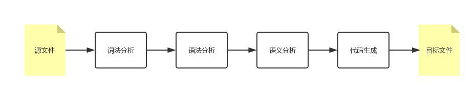
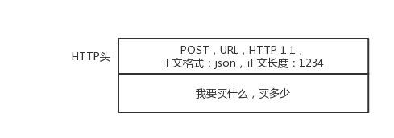
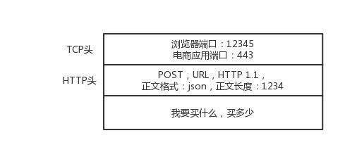
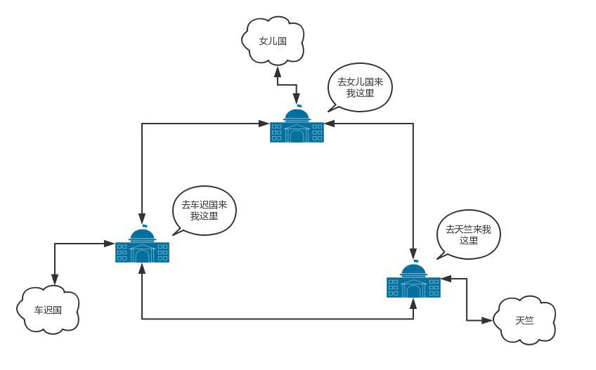
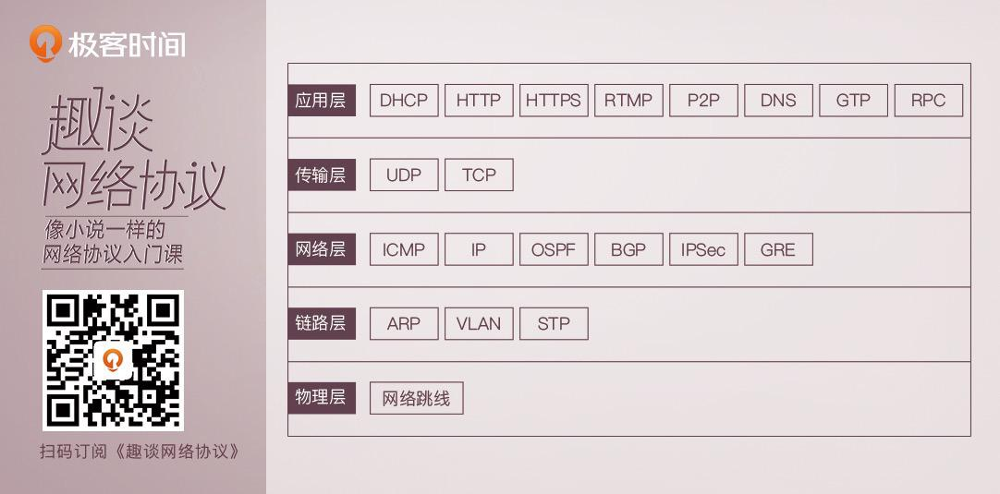

# 第 1 讲 | 为什么要学习网络协议？

> 刘超 2018-05-18

《圣经》中有一个通天塔的故事，大致是说，上帝为了阻止人类联合起来，就让人类说不同的语言。人类没法儿沟通，达不成「协议」，通天塔的计划就失败了。但是千年以后，有一种叫「程序猿」的物种，敲着一种这个群体通用的语言，连接着全世界所有的人，打造这互联网世界的通天塔。如今的世界，正是因为互联网，才连接在一起。

当「Hello World!」从显示器打印出来的时候，还记得你激动的心情吗？

```

public class HelloWorld {

  public static void main(String[] args){

    System.out.println("Hello World!");

  }

}

```

如果你是程序员，一定看得懂上面这一段文字。这是每一个程序员向计算机世界说「你好，世界」的方式。但是，你不一定知道，这段文字也是一种协议，是人类和计算机沟通的协议，只有通过这种协议，计算机才知道我们想让它做什么。

## 01. 协议三要素

当然，这种协议还是更接近人类语言，机器不能直接读懂，需要进行翻译，翻译的工作教给编译器，也就是程序员常说的 compile。这个过程比较复杂，其中的编译原理非常复杂，我在这里不进行详述。



但是可以看得出，计算机语言作为程序员控制一台计算机工作的协议，具备了协议的三要素。

1. 语法，就是这一段内容要符合一定的规则和格式。例如，括号要成对，结束要使用分号等。

2. 语义，就是这一段内容要代表某种意义。例如数字减去数字是有意义的，数字减去文本一般来说就没有意义。

3. 顺序，就是先干啥，后干啥。例如，可以先加上某个数值，然后再减去某个数值。

会了计算机语言，你就能够教给一台计算机完成你的工作了。恭喜你，入门了！

但是，要想打造互联网世界的通天塔，只教给一台机器做什么是不够的，你需要学会教给一大片机器做什么。这就需要网络协议。只有通过网络协议，才能使一大片机器互相协作、共同完成一件事。

这个时候，你可能会问，网络协议长啥样，这么神奇，能干成啥事？我先拿一个简单的例子，让你尝尝鲜，然后再讲一个大事。

当你想要买一个商品，常规的做法就是打开浏览器，输入购物网站的地址。浏览器就会给你显示一个缤纷多彩的页面。

那你有没有深入思考过，浏览器是如何做到这件事情的？它之所以能够显示缤纷多彩的页面，是因为它收到了一段来自 HTTP 协议的「东西」。我拿网易考拉来举例，格式就像下面这样：

HTTP/1.1 200 OK

Date: Tue, 27 Mar 2018 16:50:26 GMT

Content-Type: text/html;charset=UTF-8

Content-Language: zh-CN

<!DOCTYPE html>

<html>

<head>

<base href="https://pages.kaola.com/" />

<meta charset="utf-8"/> <title> 网易考拉 3 周年主会场 </title>

这符合协议的三要素吗？我带你来看一下。

首先，符合语法，也就是说，只有按照上面那个格式来，浏览器才认。例如，上来是状态，然后是首部，然后是内容。

第二，符合语义，就是要按照约定的意思来。例如，状态 200，表述的意思是网页成功返回。如果不成功，就是我们常见的「404」。

第三，符合顺序，你一点浏览器，就是发送出一个 HTTP 请求，然后才有上面那一串 HTTP 返回的东西。

浏览器显然按照协议商定好的做了，最后一个五彩缤纷的页面就出现在你面前了。

我们常用的网络协议有哪些？

接下来揭秘我要说的大事情，「双十一」。这和我们要讲的网络协议有什么关系呢？

在经济学领域，有个伦纳德·里德（Leonard E. Read）创作的《铅笔的故事》。这个故事通过一个铅笔的诞生过程，来讲述复杂的经济学理论。这里，我也用一个下单的过程，看看互联网世界的运行过程中，都使用了哪些网络协议。

你先在浏览器里面输入 https://www.kaola.com ，这是一个 URL。浏览器只知道名字是「www.kaola.com」，但是不知道具体的地点，所以不知道应该如何访问。于是，它打开地址簿去查找。可以使用一般的地址簿协议 DNS 去查找，还可以使用另一种更加精准的地址簿查找协议 HTTPDNS。

无论用哪一种方法查找，最终都会得到这个地址：106.114.138.24。这个是 IP 地址，是互联网世界的「门牌号」。

知道了目标地址，浏览器就开始打包它的请求。对于普通的浏览请求，往往会使用 HTTP 协议；但是对于购物的请求，往往需要进行加密传输，因而会使用 HTTPS 协议。无论是什么协议，里面都会写明「你要买什么和买多少」。



DNS、HTTP、HTTPS 所在的层我们称为应用层。经过应用层封装后，浏览器会将应用层的包交给下一层去完成，通过 socket 编程来实现。下一层是传输层。传输层有两种协议，一种是无连接的协议 UDP，一种是面向连接的协议 TCP。对于支付来讲，往往使用 TCP 协议。所谓的面向连接就是，TCP 会保证这个包能够到达目的地。如果不能到达，就会重新发送，直至到达。

TCP 协议里面会有两个端口，一个是浏览器监听的端口，一个是电商的服务器监听的端口。操作系统往往通过端口来判断，它得到的包应该给哪个进程。



传输层封装完毕后，浏览器会将包交给操作系统的网络层。网络层的协议是 IP 协议。在 IP 协议里面会有源 IP 地址，即浏览器所在机器的 IP 地址和目标 IP 地址，也即电商网站所在服务器的 IP 地址。


操作系统既然知道了目标 IP 地址，就开始想如何根据这个门牌号找到目标机器。操作系统往往会判断，这个目标 IP 地址是本地人，还是外地人。如果是本地人，从门牌号就能看出来，但是显然电商网站不在本地，而在遥远的地方。

操作系统知道要离开本地去远方。虽然不知道远方在何处，但是可以这样类比一下：如果去国外要去海关，去外地就要去网关。而操作系统启动的时候，就会被 DHCP 协议配置 IP 地址，以及默认的网关的 IP 地址 192.168.1.1。

操作系统如何将 IP 地址发给网关呢？在本地通信基本靠吼，于是操作系统大吼一声，谁是 192.168.1.1 啊？网关会回答它，我就是，我的本地地址在村东头。这个本地地址就是 MAC 地址，而大吼的那一声是 ARP 协议。


于是操作系统将 IP 包交给了下一层，也就是 MAC 层。网卡再将包发出去。由于这个包里面是有 MAC 地址的，因而它能够到达网关。

网关收到包之后，会根据自己的知识，判断下一步应该怎么走。网关往往是一个路由器，到某个 IP 地址应该怎么走，这个叫作路由表。

路由器有点像玄奘西行路过的一个个国家的一个个城关。每个城关都连着两个国家，每个国家相当于一个局域网，在每个国家内部，都可以使用本地的地址 MAC 进行通信。

一旦跨越城关，就需要拿出 IP 头来，里面写着贫僧来自东土大唐（就是源 IP 地址），欲往西天拜佛求经（指的是目标 IP 地址）。路过宝地，借宿一晚，明日启行，请问接下来该怎么走啊？


城关往往是知道这些「知识」的，因为城关和临近的城关也会经常沟通。到哪里应该怎么走，这种沟通的协议称为路由协议，常用的有 OSPF 和 BGP。



城关与城关之间是一个国家，当网络包知道了下一步去哪个城关，还是要使用国家内部的 MAC 地址，通过下一个城关的 MAC 地址，找到下一个城关，然后再问下一步的路怎么走，一直到走出最后一个城关。

最后一个城关知道这个网络包要去的地方。于是，对着这个国家吼一声，谁是目标 IP 啊？目标服务器就会回复一个 MAC 地址。网络包过关后，通过这个 MAC 地址就能找到目标服务器。

目标服务器发现 MAC 地址对上了，取下 MAC 头来，发送给操作系统的网络层。发现 IP 也对上了，就取下 IP 头。IP 头里会写上一层封装的是 TCP 协议，然后将其交给传输层，即 TCP 层。

在这一层里，对于收到的每个包，都会有一个回复的包说明收到了。这个回复的包绝非这次下单请求的结果，例如购物是否成功，扣了多少钱等，而仅仅是 TCP 层的一个说明，即收到之后的回复。当然这个回复，会沿着刚才来的方向走回去，报个平安。

因为一旦出了国门，西行路上千难万险，如果在这个过程中，网络包走丢了，例如进了大沙漠，或者被强盗抢劫杀害怎么办呢？因而到了要报个平安。

如果过一段时间还是没到，发送端的 TCP 层会重新发送这个包，还是上面的过程，直到有一天收到平安到达的回复。这个重试绝非你的浏览器重新将下单这个动作重新请求一次。对于浏览器来讲，就发送了一次下单请求，TCP 层不断自己闷头重试。除非 TCP 这一层出了问题，例如连接断了，才轮到浏览器的应用层重新发送下单请求。

当网络包平安到达 TCP 层之后，TCP 头中有目标端口号，通过这个端口号，可以找到电商网站的进程正在监听这个端口号，假设一个 Tomcat，将这个包发给电商网站。


电商网站的进程得到 HTTP 请求的内容，知道了要买东西，买多少。往往一个电商网站最初接待请求的这个 Tomcat 只是个接待员，负责统筹处理这个请求，而不是所有的事情都自己做。例如，这个接待员要告诉专门管理订单的进程，登记要买某个商品，买多少，要告诉管理库存的进程，库存要减少多少，要告诉支付的进程，应该付多少钱，等等。

如何告诉相关的进程呢？往往通过 RPC 调用，即远程过程调用的方式来实现。远程过程调用就是当告诉管理订单进程的时候，接待员不用关心中间的网络互连问题，会由 RPC 框架统一处理。RPC 框架有很多种，有基于 HTTP 协议放在 HTTP 的报文里面的，有直接封装在 TCP 报文里面的。

当接待员发现相应的部门都处理完毕，就回复一个 HTTPS 的包，告知下单成功。这个 HTTPS 的包，会像来的时候一样，经过千难万险到达你的个人电脑，最终进入浏览器，显示支付成功。

## 小结

看到了吧，一个简简单单的下单过程，中间牵扯到这么多的协议。而管理一大片机器，更是一件特别有技术含量的事情。除此之外，像最近比较火的云计算、容器、微服务等技术，也都需要借助各种协议，来达成大规模机器之间的合作。

我在这里列一下之后要讲的网络协议，之后我会按照从底层到上层的顺序来讲述。



上面的「双十一」故事只是为了给你一个大致的框架，这里面有些协议，我在故事里已经提到了，有些还没有提到。在这门课的最后一章，当所有的协议都讲过之后，我会再重新讲一遍这个故事，到时候你就能明白更多的细节。

最后，学完了这一节，给你留一个问题吧。

当网络包到达一个城关的时候，可以通过路由表得到下一个城关的 IP 地址，直接通过 IP 地址找就可以了，为什么还要通过本地的 MAC 地址呢？

## 黑板墙

### 01

芒果：

个人发表一下对这个问题的看法，抛砖引玉，希望老师指正：1. 局域网内 IP 地址是动态分配的，假如我是 192.168.2.100，如果我下线了，可能 IP 就分配给了另一台电脑。IP 和设备并不总是对应的，这对通信就产生了问题，但是 MAC 地址不同，MAC 地址和设备是一一对应且全球唯一的。所以局域网使用 MAC 地址通信没有问题。2. 历史遗留问题：早期的以太网只有交换机，没有路由器，以太网内通过 MAC 地址通信。后来才有了互联网，为了兼容原本的模式，采用了 IP+MAC 地址通信的方式。为啥不推到了重来呢？看看 IPv6 的处境你就知道了。所以是先有 MAC 地址后有的 IP，IP 的提出主要还是因为 MAC 地址本身的缺陷，这个问题换成有了 MAC 为何还要 IP 地址也很有意思。3. 我这里简单说一下第一：MAC 地址本身的缺陷：因为 MAC 地址是硬件提供商写在网卡中的，MAC 地址虽然唯一但是不能表明用户在整个互联网中的位置，除非维护一个超级大 MAC 地址对应表，那寻址效率肯定爆炸。但是 IP 地址解决了这个问题，因为 IP 地址是网络提供商给你的，所以你在哪里整个网络都是知道的。第二：安全问题：获取 MAC 地址是通过 ARP 协议来完成的，如果只用 MAC 地址通信，那么广播风暴是个难题。4. 那么我觉得如果哪天每人一个固定的 IPv6 地址，那么我觉得 MAC 地址 + IPv4 的模式是不是可以被替换了？

2018-05-18

陶家顺

1. mac 地址是唯一的，为什么可以修改？想想身份证，身份证号是唯一的，不能改变的，但是可以造价。mac 地址全球唯一，它是固化在网卡里的。网卡毕竟是个硬件，需要软件支持，既操作系统识别。重点来了，操作系统识别出来的 mac 地址是可以更改的，它只不过是一个字符串。我们常说的修改 mac 指的是修改电脑中记录的既注册表中的记录。

2. 有了 mac 地址为什么还要有 ip 地址。举个例子，身份证号是你的唯一标识，不会重复，一落户就有（网卡一出厂就有 mac）。现在我要和你通信（写信给你），地址用你的姓名 + 身份证，信能送到你手上吗？明显不能！身份证号前六位能定位你出生的县。mac 地址前几位也可以定位生产厂家。但是你出生后会离开这个县（哪怕在这个县，也不能具体找到你）。所以一般写个人信息就要有出生地和现居地址了。

作者回复：这个解释太详细了

2018-08-23

尼古拉

mac 好比人的身份 id，ip 好比他的住址，住址可以变，人的身份🆔不会变。

2018-05-23

党

ip 是网络层使用的 mac 是链路层使用的 ip 包最终还是要通过物理链接和 mac 地址进行交互的

作者回复：对的

2018-05-29

执笔书生

因为 mac 地址是全世界唯一的，不会找错人！而 ip 地址会是发生改变的！有可能现在 ip 地址 A 是这里的地址！在下一刻就是 B 的地址了！

综上所述：所以要有 mac 地址！

2018-05-18

初学者

看到这篇文章，让我想起了一本书：网络是怎样连接的。我看到有小伙伴问推荐的书籍，可惜我无法直接在这里回复它

2018-05-18

iceco1a

网卡 MAC 码是由全球惟一的一个固定组织来分配的，未经认证和授权的厂家无权生产网卡。每块网卡都有一个固定的卡号，并且任何正规厂家生产的网卡上都直接标明了卡号，一般为一组 12 位的 16 进制数。其中前 6 位代表网卡的生产厂商。后面的位数是设备号。当然在操作系统级别改 Mac 地址又是一种说法。

作者回复：赞

2018-05-31

小田

摘要

# 协议三要素

语法、语义、顺序

# 网络数据包结构

Mac 头 Ip 头 Tcp 头 Http 头 数据体

# 网络五层模型

1. 物理层：连接

2. 链路层：定位

3. 传输层：路由

4. 会话层：会话连接机制

5. 应用层：数据封装格式

2018-06-04

zwfec

很多人都说 mac 地址是唯一的，不变的，网络老师也这么说，

1. 但记得大学时为了能上网，在 windows XP 下自己改了 mac 地铁就可以了，可能只是操作系统级别的修改，但理解起来好矛盾

2. 如果是全球唯一的，那么意思是这些网卡厂商都要维护自己的 mac 列表？以保证和其它厂商绝对不重复，有这样的机构吗

真是困惑，自己猜想 mac 唯一应该也只是保证局域网内保证唯一吧

2018-05-18

Rimin

假如有 MAC 地址没有 ip 地址可以吗？答案是不行，因为全世界存在各种网络，它们使用不同硬件地址。要使这些网络能互相通信就必须进行非常复杂的硬件地址转换工作。但可以用抽象的 ip 地址把这个问题解决。

那么假如没有 MAC 地址而只有 ip 呢？同样不行，ip 地址只是一种抽象的逻辑地址用于标记唯一性，而传输的数据是要从网络层到数据链路层或由数据链路层到网络层的，ip 数据报并不能和下层硬件「沟通」，所以还要被封装 MAC 帧。即将 IP 地址解析为链路层所需硬件地址。

目前是这么理解的，欢迎交流指正。

2018-05-18

Geek-Leon

有既不走 UDP 又不走 TCP 的应用层协议吗？

作者回复：有的，传输层大部分情况下是 tcp 和 udp，但是也有其他的协议比如 sctp

2018-05-18

橙子

没有 MAC 地址，靠 IP 也是可以做 MAC 地址的事情，但是由于分层，IP 负责网络层传输，MAC 负责链路层传输，IP 和 MAC 通过 ARP 协议映射，比如任何人沟通，可以通过电话，短信，微信，或者邮件，但是不同场合用的工具不一样

2018-05-18

hansc

对于服务器来说，源地址一般是路由器的外网地址，内网机器没有外网地址，目标地址会把报文发给路由器，路由器根据 mac 地址，在 arp 缓存找到内网地址。

2018-05-18

罗格

十分感谢作者大大的回复，今天才看到不好意思，我自己后来发现还是有些疑问在纠结，查了许多相关资料还是没解决，又厚着脸皮来请教……

一、文中说」每个城关都连着两个国家，」，又说「城关与城关之间是一个国家」，因为「城关是路由器，国家是局域网」，那关系就是「局域网 — 路由器 — 局域网 — 路由器 — 局域网」这样子吗？

二、"当网络包知道了下一步去哪个城关，还是要使用国家内部的 mac 地址"，是因为上面路由器和局域网关系中的两个路由器都处于中间那个局域网中的原因所以可以使用 arp 协议获取对方的 mac 地址吗？还是上面说的 OSPF 协议呢（我查的资料里说 OSPF 获取的是链路状态，具体没说 mac 地址还是 ip 地址）？

三、「本地通讯基本 kao 吼」，ARP 协议只在本地作用么？这个「本地」是指局域网还是什么？

四、我查阅的资料里说自治系统中是包含多个路由器的，而且通常一个自治系统也包含多个局域网，那一个局域网里会包含多个路由器吗？如果我第一个问题里的图成立的话那意味着每个局域网都有两个路由器？

上述四个问题困扰我许久，对我原来的认知产生了一些颠覆，还望作者大大不吝赐教，万分感谢……

作者回复：问题一，你的理解正确。问题二，去哪个网段应该怎么走，用 ospf，也就是城关管理员直接交换信息用 ospf，一旦一个包来到城关，就根据已知信息选择下一个城关，一旦选择了城关，就通过 arp 得到地址发送。问题三，本地是指局域网。问题四，一个局域网不会有多个路由器，局域网边界上是路由器

2018-12-04

lujg

在公网中通信只能用公网 ip，而对于公网 ip 是按照区域分配的，路由器是可以知道目标 ip 的大范围的区域，然后从大区域慢慢向小区域传送的。可以类比我们去某地的一个过程，比如你从北京到深圳某公司，你需要先去飞机场，然后坐飞机去深圳，再通过市内交通到达目的地。

而对于 Mac 地址，这是标识机器的一个地址，在出厂时就确定的，但是单 mac 所在的区域不是固定的，而是会移动的。即你从北京到深圳后，你的 IP 是会变的，但 mac 是不会变的。所以是无法通过 mac 地址寻找到你所在位置的。

理论上是可以通过一个大查找表知道每一个 mac 所在的位置，然后通过查表知道你所在的位置然后根据 mac 做一个转发，但是查找的代价是很高的。

其实手机通过数据上网就是一个通过类似 mac 寻址的一个网络。在移动网络中是允许你移动的，这是由于基站会记录你的位置信息。并且核心网与公网的通信是通过 ip 来实现的，而在手机和基站间的通信是通过类似 mac 的一个唯一码实现的。并且移动网络整体建设成本比互联网的成本高很多，消费也高很多。

2018-05-18

clean

先有 mac 后有 ip，以前的网络并没有统一，很多地方有自己的网络结构，导致资源互联很难。ip 是统一异构网络的。ip 是全球范围内的，mac 是一跳范围内的。如果真的只用 mac 来寻址，维护 mac 的成本很高，而且如果在路由表中记录 mac 很容易出现广播风暴 网络就瘫痪了。所以设计者考虑了很多才在 mac 层上面加一层 IP 这样能更好的解决网络异构问题 和 传输效率问题。

2018-08-11

行者

写的真好。

另外老师是不是订阅了薛兆丰老师的经济课，一只铅笔的故事。^ _ ^

2018-05-19

石头

刘师，你好，请问有什么通俗易懂的教材可以推荐下吗？

2018-05-18

蔡波

IP 是负责三层通信通过查找路由表，层层传递，最终到达目的设备，Mac 负责二层通信，设备上的 ARP 表是 IP 和 Mac 的对应关系，通过 ARP 表找到目的 IP 的 Mac 地址。

2018-05-18

徐良红

关于老师最后的问题，我觉得是这样：ip 报文端到端的传输过程中，目的地址和源地址是不变的，但是每通过一个网关，源 mac 和目的 mac 一直在变。两个王国之间的网关要通过 mac 互相传递报文。

2018-05-19

零下一度

2 层的传输是通过 MAC 地址来标识

2018-05-19

moring~

求解释下名词，比如说，网关

2018-05-19

糖小宝

感觉 Mac 地址是手机号码，IP 地址是省市区加街道详情

点外卖的话，只有手机号码是找不到订餐人的

只有按照省市区加街道详情，找到对应办公室

大吼一声：「尾号 XXXX 是哪位？您的外卖到了！！！」

订餐人：「这儿呐～我哒～」

END

作者回复：赞

2019-05-15

云飞扬

有点儿笼统，希望讲的再详细一点

作者回复：这是第一章，先给个大概的印象

2018-05-18

linxs

我个人肤浅的理解，信息在传递过程中，需要终点地址和下一跳的地址。终点地址是目的 IP 地址，下一跳的地址是 Mac 地址。在跳到下一级地址的时候，IP 地址不会变，Mac 地址会变。Mac 地址是记录下一跳地址的信息

2018-05-18

zhangc

tcp 重试有没有可能导致重复下单？

作者回复：不会的，就算 http 的重试也不应该导致重复下单，要求接口幂等

2018-05-27

千年孤独

「城关与城关之间是一个国家，当网络包知道了下一步去哪个城关，还是要使用国家内部的 MAC 地址，通过下一个城关的 MAC 地址」这话不是很理解，为何城与城之间一定要存在着国家呢？还望老师解惑

2018-05-21

赤脚小子

写的太棒了！我看过几本网易的书都很不错，很多网易人写的文章质量也很高，所以没有任何犹豫的就买了这个课，这一章就让我感受到了花的太值了。

