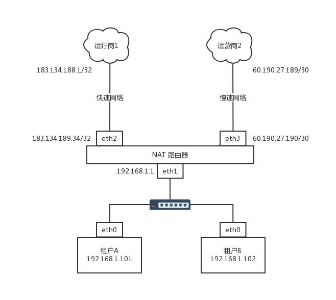
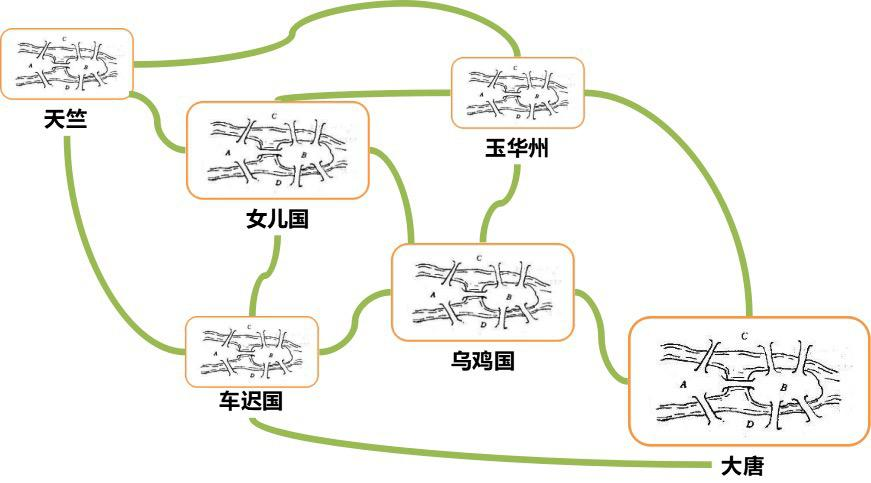
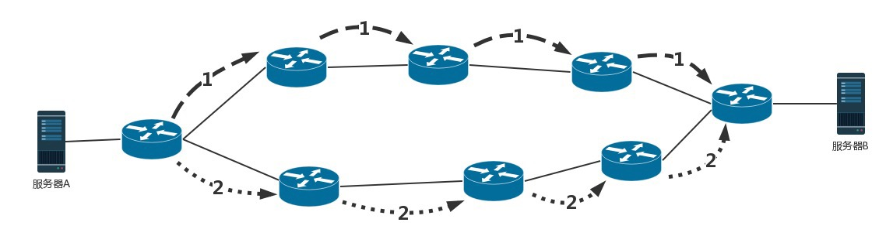

# 第 9 讲 | 路由协议：西出网关无故人，敢问路在何方

刘超 2018-06-06

俗话说得好，在家千日好，出门一日难。网络包一旦出了网关，就像玄奘西行一样踏上了江湖漂泊的路。

上一节我们描述的是一个相对简单的情形。出了网关之后，只有一条路可以走。但是，网络世界复杂得多，一旦出了网关，会面临着很多路由器，有很多条道路可以选。如何选择一个更快速的道路求取真经呢？这里面还有很多门道可以讲。

## 01. 如何配置路由？

通过上一节的内容，你应该已经知道，路由器就是一台网络设备，它有多张网卡。当一个入口的网络包送到路由器时，它会根据一个本地的转发信息库，来决定如何正确地转发流量。这个转发信息库通常被称为路由表。

一张路由表中会有多条路由规则。每一条规则至少包含这三项信息。

目的网络：这个包想去哪儿？

出口设备：将包从哪个口扔出去？

下一跳网关：下一个路由器的地址。

通过 route 命令和 ip route 命令都可以进行查询或者配置。

例如，我们设置 ip route add 10.176.48.0/20 via 10.173.32.1 dev eth0，就说明要去 10.176.48.0/20 这个目标网络，要从 eth0 端口出去，经过 10.173.32.1。

上一节的例子中，网关上的路由策略就是按照这三项配置信息进行配置的。这种配置方式的一个核心思想是：根据目的 IP 地址来配置路由。

## 02. 如何配置策略路由？

当然，在真实的复杂的网络环境中，除了可以根据目的 ip 地址配置路由外，还可以根据多个参数来配置路由，这就称为策略路由。

可以配置多个路由表，可以根据源 IP 地址、入口设备、TOS 等选择路由表，然后在路由表中查找路由。这样可以使得来自不同来源的包走不同的路由。

例如，我们设置：

ip rule add from 192.168.1.0/24 table 10 

ip rule add from 192.168.2.0/24 table 20

表示从 192.168.1.10/24 这个网段来的，使用 table 10 中的路由表，而从 192.168.2.0/24 网段来的，使用 table20 的路由表。

在一条路由规则中，也可以走多条路径。例如，在下面的路由规则中：

ip route add default scope global nexthop via 100.100.100.1 weight 1 nexthop via 200.200.200.1 weight 2

下一跳有两个地方，分别是 100.100.100.1 和 200.200.200.1，权重分别为 1 比 2。

在什么情况下会用到如此复杂的配置呢？我来举一个现实中的例子。

我是房东，家里从运营商那儿拉了两根网线。这两根网线分别属于两个运行商。一个带宽大一些，一个带宽小一些。这个时候，我就不能买普通的家用路由器了，得买个高级点的，可以接两个外网的。

家里的网络呢，就是普通的家用网段 192.168.1.x/24。家里有两个租户，分别把线连到路由器上。IP 地址为 192.168.1.101/24 和 192.168.1.102/24，网关都是 192.168.1.1/24，网关在路由器上。

就像上一节说的一样，家里的网段是私有网段，出去的包需要 NAT 成公网的 IP 地址，因而路由器是一个 NAT 路由器。

两个运营商都要为这个网关配置一个公网的 IP 地址。如果你去查看你们家路由器里的网段，基本就是我图中画的样子。

运行商里面也有一个 IP 地址，在运营商网络里面的网关。不同的运营商方法不一样，有的是 /32 的，也即一个一对一连接。

例如，运营商 1 给路由器分配的地址是 183.134.189.34/32，而运营商网络里面的网关是 183.134.188.1/32。有的是 /30 的，也就是分了一个特别小的网段。运营商 2 给路由器分配的地址是 60.190.27.190/30，运营商网络里面的网关是 60.190.27.189/30。

根据这个网络拓扑图，可以将路由配置成这样：

$ ip route list table main 

60.190.27.189/30 dev eth3  proto kernel  scope link  src 60.190.27.190

183.134.188.1 dev eth2  proto kernel  scope link  src 183.134.189.34

192.168.1.0/24 dev eth1  proto kernel  scope link  src 192.168.1.1

127.0.0.0/8 dev lo  scope link

default via 183.134.188.1 dev eth2

当路由这样配置的时候，就告诉这个路由器如下的规则：

如果去运营商二，就走 eth3；

如果去运营商一呢，就走 eth2；

如果访问内网，就走 eth1；

如果所有的规则都匹配不上，默认走运营商一，也即走快的网络。

但是问题来了，租户 A 不想多付钱，他说我就上上网页，从不看电影，凭什么收我同样贵的网费啊？没关系，咱有技术可以解决。

下面我添加一个 Table，名字叫 chao。

    # echo 200 chao >> /etc/iproute2/rt_tables

添加一条规则：

默认的路由走慢的，谁让你不付钱。

上面说的都是静态的路由，一般来说网络环境简单的时候，在自己的可控范围之内，自己捣鼓还是可以的。但是有时候网络环境复杂并且多变，如果总是用静态路由，一旦网络结构发生变化，让网络管理员手工修改路由太复杂了，因而需要动态路由算法。

## 03. 动态路由算法

使用动态路由路由器，可以根据路由协议算法生成动态路由表，随网络运行状况的变化而变化。那路由算法是什么样的呢？

我们可以想象唐僧西天取经，需要解决两大问题，一个是在每个国家如何找到正确的路，去换通关文牒、吃饭、休息；一个是在国家之间，野外行走的时候，如何找到正确的路、水源的问题。

无论是一个国家内部，还是国家之间，我们都可以将复杂的路径，抽象为一种叫作图的数据结构。至于唐僧西行取经，肯定想走得路越少越好，道路越短越好，因而这就转化成为如何在途中找到最短路径的问题。

咱们在大学里面学习计算机网络与数据结构的时候，知道求最短路径常用的有两种方法，一种是 Bellman-Ford 算法，一种是 Dijkstra 算法。在计算机网络中基本也是用这两种方法计算的。

### 1. 距离矢量路由算法

第一大类的算法称为距离矢量路由（distance vector routing）。它是基于 Bellman-Ford 算法的。

这种算法的基本思路是，每个路由器都保存一个路由表，包含多行，每行对应网络中的一个路由器，每一行包含两部分信息，一个是要到目标路由器，从那条线出去，另一个是到目标路由器的距离。

由此可以看出，每个路由器都是知道全局信息的。那这个信息如何更新呢？每个路由器都知道自己和邻居之间的距离，每过几秒，每个路由器都将自己所知的到达所有的路由器的距离告知邻居，每个路由器也能从邻居那里得到相似的信息。

每个路由器根据新收集的信息，计算和其他路由器的距离，比如自己的一个邻居距离目标路由器的距离是 M，而自己距离邻居是 x，则自己距离目标路由器是 x+M。

这个算法比较简单，但是还是有问题。

第一个问题就是好消息传得快，坏消息传得慢。如果有个路由器加入了这个网络，它的邻居就能很快发现它，然后将消息广播出去。要不了多久，整个网络就都知道了。但是一旦一个路由器挂了，挂的消息是没有广播的。当每个路由器发现原来的道路到不了这个路由器的时候，感觉不到它已经挂了，而是试图通过其他的路径访问，直到试过了所有的路径，才发现这个路由器是真的挂了。

我再举个例子。

原来的网络包括两个节点，B 和 C。A 加入了网络，它的邻居 B 很快就发现 A 启动起来了。于是它将自己和 A 的距离设为 1，同样 C 也发现 A 起来了，将自己和 A 的距离设置为 2。但是如果 A 挂掉，情况就不妙了。B 本来和 A 是邻居，发现连不上 A 了，但是 C 还是能够连上，只不过距离远了点，是 2，于是将自己的距离设置为 3。殊不知 C 的距离 2 其实是基于原来自己的距离为 1 计算出来的。C 发现自己也连不上 A，并且发现 B 设置为 3，于是自己改成距离 4。依次类推，数越来越大，直到超过一个阈值，我们才能判定 A 真的挂了。

这个道理有点像有人走丢了。当你突然发现找不到这个人了。于是你去学校问，是不是在他姨家呀？找到他姨家，他姨说，是不是在他舅舅家呀？他舅舅说，是不是在他姥姥家呀？他姥姥说，是不是在学校呀？总归要问一圈，或者是超过一定的时间，大家才会认为这个人的确走丢了。如果这个人其实只是去见了一个谁都不认识的网友去了，当这个人回来的时候，只要他随便见到其中的一个亲戚，这个亲戚就会拉着他到他的家长那里，说你赶紧回家，你妈都找你一天了。

这种算法的第二个问题是，每次发送的时候，要发送整个全局路由表。网络大了，谁也受不了，所以最早的路由协议 RIP 就是这个算法。它适用于小型网络（小于 15 跳）。当网络规模都小的时候，没有问题。现在一个数据中心内部路由器数目就很多，因而不适用了。

所以上面的两个问题，限制了距离矢量路由的网络规模。

### 2. 链路状态路由算法

第二大类算法是链路状态路由（link state routing），基于 Dijkstra 算法。

这种算法的基本思路是：当一个路由器启动的时候，首先是发现邻居，向邻居 say hello，邻居都回复。然后计算和邻居的距离，发送一个 echo，要求马上返回，除以二就是距离。然后将自己和邻居之间的链路状态包广播出去，发送到整个网络的每个路由器。这样每个路由器都能够收到它和邻居之间的关系的信息。因而，每个路由器都能在自己本地构建一个完整的图，然后针对这个图使用 Dijkstra 算法，找到两点之间的最短路径。

不像距离距离矢量路由协议那样，更新时发送整个路由表。链路状态路由协议只广播更新的或改变的网络拓扑，这使得更新信息更小，节省了带宽和 CPU 利用率。而且一旦一个路由器挂了，它的邻居都会广播这个消息，可以使得坏消息迅速收敛。

## 04. 动态路由协议

### 1. 基于链路状态路由算法的 OSPF

OSPF（Open Shortest Path First，开放式最短路径优先）就是这样一个基于链路状态路由协议，广泛应用在数据中心中的协议。由于主要用在数据中心内部，用于路由决策，因而称为内部网关协议（Interior Gateway Protocol，简称 IGP）。

内部网关协议的重点就是找到最短的路径。在一个组织内部，路径最短往往最优。当然有时候 OSPF 可以发现多个最短的路径，可以在这多个路径中进行负载均衡，这常常被称为等价路由。

这一点非常重要。有了等价路由，到一个地方去可以有相同的两个路线，可以分摊流量，还可以当一条路不通的时候，走另外一条路。这个在后面我们讲数据中心的网络的时候，一般应用的接入层会有负载均衡 LVS。它可以和 OSPF 一起，实现高吞吐量的接入层设计。

有了内网的路由协议，在一个国家内，唐僧可以想怎么走怎么走了，两条路选一条也行。

### 2. 基于距离矢量路由算法的 BGP

但是外网的路由协议，也即国家之间的，又有所不同。我们称为外网路由协议（Border Gateway Protocol，简称 BGP）。

在一个国家内部，有路当然选近的走。但是国家之间，不光远近的问题，还有政策的问题。例如，唐僧去西天取经，有的路近。但是路过的国家看不惯僧人，见了僧人就抓。例如灭法国，连光头都要抓。这样的情况即便路近，也最好绕远点走。

对于网络包同样，每个数据中心都设置自己的 Policy。例如，哪些外部的 IP 可以让内部知晓，哪些内部的 IP 可以让外部知晓，哪些可以通过，哪些不能通过。这就好比，虽然从我家里到目的地最近，但是不能谁都能从我家走啊！

在网络世界，这一个个国家成为自治系统 AS（Autonomous System）。自治系统分几种类型。

Stub AS：对外只有一个连接。这类 AS 不会传输其他 AS 的包。例如，个人或者小公司的网络。

Multihomed AS：可能有多个连接连到其他的 AS，但是大多拒绝帮其他的 AS 传输包。例如一些大公司的网络。

Transit AS：有多个连接连到其他的 AS，并且可以帮助其他的 AS 传输包。例如主干网。

每个自治系统都有边界路由器，通过它和外面的世界建立联系。

BGP 又分为两类，eBGP 和 iBGP。自治系统间，边界路由器之间使用 eBGP 广播路由。内部网络也需要访问其他的自治系统。边界路由器如何将 BGP 学习到的路由导入到内部网络呢？就是通过运行 iBGP，使得内部的路由器能够找到到达外网目的地的最好的边界路由器。

BGP 协议使用的算法是路径矢量路由协议（path-vector protocol）。它是距离矢量路由协议的升级版。

前面说了距离矢量路由协议的缺点。其中一个是收敛慢。在 BGP 里面，除了下一跳 hop 之外，还包括了自治系统 AS 的路径，从而可以避免坏消息传的慢的问题，也即上面所描述的，B 知道 C 原来能够到达 A，是因为通过自己，一旦自己都到达不了 A 了，就不用假设 C 还能到达 A 了。

另外，在路径中将一个自治系统看成一个整体，不区分自治系统内部的路由器，这样自治系统的数目是非常有限的。就像大家都能记住出去玩，从中国出发先到韩国然后到日本，只要不计算细到具体哪一站，就算是发送全局信息，也是没有问题的。

## 小结

好了，这一节就到这里了，我来做个总结：

路由分静态路由和动态路由，静态路由可以配置复杂的策略路由，控制转发策略；

动态路由主流算法有两种，距离矢量算法和链路状态算法。基于两种算法产生两种协议，BGP 协议和 OSPF 协议。

最后，再给你留两个思考题：

路由协议要在路由器之间交换信息，这些信息的交换还需要走路由吗？不是死锁了吗？

路由器之间信息的交换使用什么协议呢？报文格式是什么样呢？

## 黑板墙

zcpromising 置顶

老师，更新前，能否解释下上一期的问题吗

作者回复：问题分两个，第一个往往是这一章的延伸思考题，一般是需要一节时间才能解释清楚的，所以不适合第二期回答，所以可能会另写文章的方式回答，第二个问题往往就是下一节内容。目前一周三篇压力还是挺大的，基本周末都进去了，所以另写的文章慢慢放出，望体谅，谢谢

2018-06-06

埃罗芒阿老师

BGP 基于 TCP，OSPF 基于 UDP

2018-06-06

西部世界

一、求最短距离的两个常见算法：

1.1 Bellman-Ford：是求含负权图的单源最短路径的一种算法，效率较低，代码难度较小。其原理为连续进行松弛，在每次松弛时把每条边都更新一下，若在 n-1 次松弛后还能更新，则说明图中有负环，因此无法得出结果，否则就完成。

1.2 Dijkstra：是从一个顶点到其余各顶点的最短路径算法，解决的是有向图中最短路径问题。迪杰斯特拉算法主要特点是以起始点为中心向外层层扩展，直到扩展到终点为止。

二、路由器的路由算法：

2.1 距离矢量路由算法：每个路由器维护一张路由表，即一个矢量，它以网络中的每个路由器为索引，表中列出了当前已知的路由器到每个目标路由器的最佳距离，以及所使用的线路。通过在邻居之间相互交换信息，路由器不断地更新他们的内部路由表。（该算法基于 Bellman-Ford）

2.2 链路状态路由算法：是要求网络中所有参与链路状态路由协议的路由器都掌握网络的全部拓扑结构信息，并记录在路由数据库中。链路状态算法中路由数据库实质上是一个网络结构的拓扑图，该拓扑图由一个节点的集合和一个边的集合构成。在网络拓扑图中，结点代表网络中路由器，边代表路由器之间的物理链路。在网络拓扑结构图中，每一条链路上可以附加不同的属性，例如链路的状态、距离或费用等。如果每一个路由器所保存的网络拓扑结构图都是一致的，那么个路由器生成的路由表也是最佳的，不存在错误路由或循环路由。（该算法基于 Dijkstra）。

三：基于两个路由算法而衍生出来的两个路由协议：

3.1 基于距离矢量路由算法的 BGP 协议：???

3.2 基于链路状态路由算法的 OSPF 协议：???

小结：

1. 距离矢量路由算法存在环回路由，慢收敛，无穷计算，扩展性差等，存在的问题：环回路由，慢收敛，无穷计算，扩展性差，仅适用于小网络场景。

2. 链路状态路由算法：链路状态算法具有更快的收敛速度，具有更好的功能扩展能力。还提供了更好的在规模上的可升级性，缺点：每个路由器需要有较大的存储空间，用以存储所收到的每一个节点的链路状态分组；计算工作量大，每次都必须计算最短路径。

===============================================================

自我查阅总结：路由协议应该比老师讲的要深的深得多。并且是基于和结合很多另外的一些知识点而形成的一整套路由方案的解决课题。要深入理解和学习的话，还要学习的太多，老师这个讲的只是一个敲门砖。

2018-12-04

灰灰

都是干货，本来是来读小说的，不知不觉学了很多东西，作为一个从事系统开发的女生表示很受用。

作者回复：谢谢

2018-06-07

heliang

老师你好，文章这部分

32765: from.10.0.0.10 lookup chao

中 10.0.0.10 的地址是不是应改为租户 A 的地址：192.168.1.101

作者回复：是的，谢谢指正

2018-09-23

一步

没学习过网络的，表示有点蒙

只能学习到有这个东西，具体的就不行了

2018-07-02

sprinty

老师您好，运营商 1 和 eth2 的连接是一对一的是什么意思？/32 的话，子网掩码是 255.255.255.255，eth2 和运营商并不在一个网络，是怎么通信的？

作者回复: p2p

2018-06-06

姜戈

学过网络的人表示很形象，相见恨晚

作者回复：谢谢

2018-06-06

小田

#提纲

1. 静态路由实现原理

- 3 项路由：目标 ip，出口 ip，下一跳网关 IP

- 策略路由：多路由表 / 多路径

2. 动态路由实现原理

- 距离矢量路由算法：BGP

- 链路状态路由算法：OSPF

2018-06-07

且听疯吟

1. 路由器之间的协议交互全部用的为组播报文，组播报文走的为专门的组播路由协议。

2. 路由器之间的协议交互采用的组播报文，根据 RFC 的规定，部分组播地址为专用的地址，用来传输路由信息。

2019-03-27

番茄尼玛

rip 是 udp 协议，ospf 直接发 ip 包。而 bgp 使用 tcp 协议，路由器之间会建立 tcp 连接，每 60s 发送一次 keep-alive 消息。

2018-06-22

William

BGP 用到的路径矢量路由协议是距离矢量路由协议的升级版，这个不太理解。老师有没有推荐的资料呢？

作者回复：就是保存了路径，计算机网络 书籍里面都有

2018-11-20

林先森

请问下老师，都说 lastmile 是网络链路中延迟最大的，也是是业界最难解决的问题，能解释下 lastmile 为什么会有比较大的延迟吗？

2018-06-06

赵强强

老师，距离矢量路由算法避免不了循环更新路由吗？比如上面举例 B 和 C，当 B 到不了 A 时，此时 B 把距离变更为不可达，当 C 向 B 发送路由信息表时，B 应该可以发现 C 到 A 的下一跳是自己，应该不更新自己就好了，并告诉 C 路由失效，就可以避免无用的循环更新。请老师解答一下。

作者回复：因为没有下一跳的信息，如果有这个相当于记录了路径了

2018-06-06

Amark

老师太厉害了，我有一个问题，我们发出去的包，半路上会不会经过某个公司的局域网，有会这种可能性吗？谢谢老师

作者回复：一般不会，可以看 BGP 协议，人家不会让你过的

2019-05-27

悦来越好

老师这一集纯干货，研究过路由协议的看的还好。建议结合例子说明，比如就是要访问谷歌，再讲每种路由是怎么游过去的，效果可能更好些。

作者回复：这个有个综合实例的

2019-03-27

eason2017

老师好，您路由协议这块可以再深入讲解一节吗？谢谢🙏

2018-08-01

iLeGeND

这个问题疑惑了我 20 年

2018-06-07

文子

请教下，在开篇简单路由器是有多个网卡的，记得路由器网络设置里分为 lan 口和 wlan 口设置，这两口的 mac 地址不同，说明 lan 和 wlan 是两个网卡，但是路由器是有多个 lan 口的，发现 lan 口的 mac 地址是统一的，这是不是说明 lan 是一个网卡，且有多个网口；wlan 是一个网卡？还有就是 lan 和 wlan 是两个网卡，他们之间的网络包传递是怎么实现的？谢谢！

作者回复：是的，家用路由器虽然多个口，但是其实像我们示意图里面一样，是一个地址加交换机的形式。wlan 和 lan 要过路由

2018-06-07

Zend

在公司内网的测试环境 就遇到 多个部署微服务的物理机网段不一样，但 http 服务走浏览器访问能通，但机器之间 ping 不通，这是为什么啊

2018-06-06

庄帝森

距离矢量路由协议讲的太形象了，我的理解就是距离矢量路由协议中的路由器就像是一个个路标，指示下一跳去哪里，老师讲的让我理解得更深刻！

2019-12-11

darren

老师您好：请问可以讲一下整个互联网硬件设施是怎么铺设连接，和我们用的路由器有什么区别么？公网 ip 在互联网中又是怎么分配设置？如果我想整一个公网 ip 弄到自己主机上要怎么搞？对整个网络没有概念，感觉对路由器工作的理解阻碍太大了。

作者回复：和家用路由器很像，就是插线，各种线。公网 IP 要去买，你个人买不到，可以去公有云上买。

2019-06-14

拿笔小星

不是从事网络相关工作的，纯 JAVA 开发，感觉越到后面越吃力！老师，对于我这种几乎的小白，有什么建议吗？

2018-11-25

疯琴

收获不小，谢谢，请问 igp 和 ibgp 是什么区别？

2018-11-23

master

一个全新的路由器加入网络，怎么得知邻居路由器的信息呢，或者说路由器们的 wan 口地址是怎么来的？

2018-10-28

武坤

本文说的路由距离，是指响应的时间吗？

2018-06-15

戴劼 DAI JIE

很多主机商售卖主机时会强调自己是 BGP 机房多线接入，虽然只有一个 ip，往往各个运营商下访问延迟都很低。这个 BGP 和文章里的 BGP 是一回事吗？他们是怎么做到的呢？

作者回复：是的，是一会儿事，会将路由广播到各个运营商

