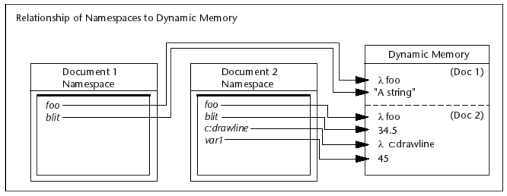

# 0102. About Namespaces (AutoLISP)

A namespace is a LISP environment containing a set of symbols (for example, variables and functions).

The concept of namespaces was introduced to prevent applications running in one drawing window from unintentionally affecting applications running in other windows. Each open AutoCAD drawing document has its own namespace. Variables and functions defined in one document namespace are isolated from variables and functions defined in other namespaces.

You can see how this works by trying a simple example.

## 01. About Referencing Variables in Document Namespaces (AutoLISP)

Variables defined in a separate-namespace VLX are not known to the document namespace associated with the VLX.

However, a separate-namespace VLX can access variables defined in a document namespace using the vl-doc-ref and vl-doc-set functions. The vl-doc-set function is the same as using the setq function.

The vl-doc-ref function copies the value of a variable from a document namespace. The function requires a single argument, a symbol identifying the variable to be copied. For example, the following copies the value of a variable named aruhu:

    (vl-doc-ref 'aruhu)

If executed within a document namespace, vl-doc-ref is equivalent to the eval function.

The vl-doc-set function sets the value of a variable in a document namespace. The function requires two arguments: a symbol identifying the variable to be set, and the value to set for the variable.

For example, the following sets the value of a variable named ulus:

    (vl-doc-set 'ulus "Go boldly to noone")

If executed within a document namespace, vl-doc-set is equivalent to the setq function. Use the vl-propagate function to set the value of a variable in all open document namespaces.

For example, the following sets a variable named fooyall in all open document namespaces:

    (setq fooyall "Go boldly and carry a soft stick")

    (vl-propagate 'fooyall)

The vl-propagate function not only copies the value of fooyall into all currently open document namespaces, but also causes fooyall to automatically be copied to the namespace of any new drawings opened during the current AutoCAD session.

### To set and retrieve variables from a document namespace (AutoLISP)

Values can be stored and retrieved from AutoLISP variables while a drawing remains open.

At the AutoCAD Command prompt or in an AutoLISP program, enter an AutoLISP statement that uses the setq function and press Enter.

Enter the name of the variable you assigned a value to and prefix it with an ! (exclamation point) to return the value assigned to the variable and press Enter.

#### Example

1. In the AutoCAD drawing environment, create or open two new drawings.

2. Do one of the following:

    - In Windows, on the ribbon, click View tab  User Interface panel  Tile Vertically. You should see two open document windows shown side by side.

    - In Mac OS, resize each drawing window so they can be seen side by side.

3. At the AutoCAD Command prompt, enter (setq draw1foo "I am drawing 1") and press Enter.

    Returns:

    "I am drawing 1"

4. Activate the second drawing by clicking in the window's title bar.

5. At the AutoCAD Command prompt, enter !draw1foo and press Enter.

    Returns:

    nil

    The variable is nil because it has not been set in this document’s.

6. At the AutoCAD Command prompt, enter (setq draw2foo "I too am a drawing, but number 2") and press Enter.

    Returns:

    "I too am a drawing, but number 2"

7. Activate the previous drawing.

8. At the AutoCAD Command prompt, enter !draw1foo and press Enter.

    Returns:

    "I am drawing 1"

9. At the AutoCAD Command prompt, enter !draw2foo and press Enter.

    Returns:

    nil

    The draw1foo variable contains the value you set in Step 3, but draw2foo is nil because you did not set it to a value in the current document; you set a different variable of the same name in the second drawing's namespace.

1『setq 是基本的赋值函数，可以赋，值、字符串等。』

## 02. About Sharing Data Between Namespaces (AutoLISP)

A namespace called the blackboard is used for communicating values across all namespaces.

The blackboard namespace is not attached to any document or VLX application. You can set and reference variables in the blackboard from any document or VLX application. Use the vl-bb-set function to set a variable, and use vl-bb-ref to retrieve a variable's value.

For example, the following sets the foobar variable to a string in the blackboard namespace:

    (vl-bb-set 'foobar "Root toot toot")

"Root toot toot"

The vl-bb-ref function returns the specified string. The following uses the vl-bb-ref function to retrieve the value of the foobar variable from the blackboard namespace:

    (vl-bb-ref 'foobar)

"Root toot toot"

Setting or retrieving variable values in the blackboard namespace has no effect on variables of the same name in any other namespace.

### To set and retrieve variables in the blackboard namespace (AutoLISP)

Variables can be stored and retrieved across multiple open drawings using the blackboard namespace.

At the AutoCAD Command prompt or from an AutoLISP program, use the vl-bb-set function to set the value of a variable in the blackboard. Use the vl-bb-ref function to retrieve the value of a variable from the blackboard.

#### Example

1. At the AutoCAD Command prompt, enter (vl-bb-set '*example* 0) and press Enter.

    Returns:

    0

The *example* variable is set to 0 in the blackboard namespace.

At the AutoCAD Command prompt, enter (vl-bb-ref '*example*) and press Enter.
Returns:

0
At the AutoCAD Command prompt, enter !*example* and press Enter.
Returns:

nil
The *example* variable returns nil because it has not been set in the document namespace.

At the AutoCAD Command prompt, enter (setq *example* -1) and press Enter.
Returns:

-1
The *example* variable is set to -1 in the document namespace.

At the AutoCAD Command prompt, enter (vl-bb-ref '*example*) and press Enter.
Returns:

0
The blackboard variable named *example* is still set to the value assigned in Step 1; setting the document variable of the same name in Step 4 had no effect on the variable in the blackboard.

You can also the vl-doc-set and vl-doc-ref functions to set and retrieve document namespace variables from a separate-namespace VLX, and vl-propagate to set the value of a variable in all open document namespaces.

## To load functions across all document namespaces (AutoLISP)

Normally, loading an application file loads it in the current drawing only, but the vl-load-all function can be used to load a file in all drawings.

At the AutoCAD Command prompt, enter an AutoLISP statement that uses the vl-load-all function and press Enter.
Note: The vl-load-all function is useful for testing new functions in multiple documents, but in general you should use acaddoc.lsp to load files that are needed in every document.
Example
At the AutoCAD Command prompt, enter (load "yinyang.lsp") and press Enter.
Invoke a function defined in the AutoLISP source (LSP) file.
The function should work as expected.

Create a new or open an existing drawing.
With the second drawing window active, try invoking the function again.
The response will be an error message saying the function is not defined.

At the AutoCAD Command prompt, enter (vl-load-all "yinyang.lsp") and press Enter.
Create a new or open an existing drawing.
Invoke the function again.
This time the function will work correctly because the vl-load-all function loads the contents of an AutoLISP file into all open documents, and into any documents opened later in the session.
