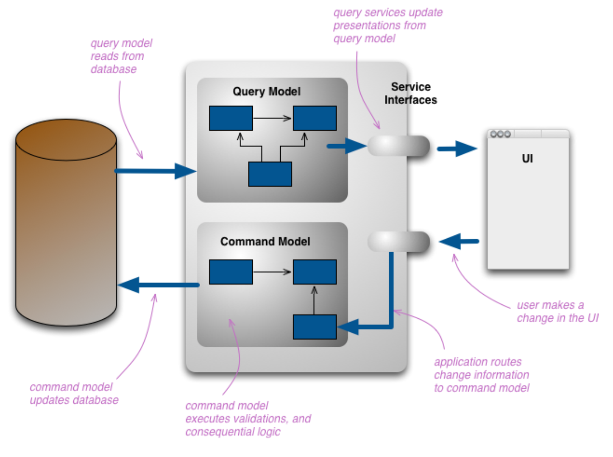

# CQRS

[CQRS](https://martinfowler.com/bliki/CQRS.html)

14 July 2011

Martin Fowler

DOMAIN DRIVEN DESIGN

APPLICATION ARCHITECTURE

API DESIGN

EVENT ARCHITECTURES

CQRS stands for Command Query Responsibility Segregation. It's a pattern that I first heard described by Greg Young. At its heart is the notion that you can use a different model to update information than the model you use to read information. For some situations, this separation can be valuable, but beware that for most systems CQRS adds risky complexity.

2『 CQRS，做一张术语卡片。』——已完成

The mainstream approach people use for interacting with an information system is to treat it as a CRUD datastore. By this I mean that we have mental model of some record structure where we can create new records, read records, update existing records, and delete records when we're done with them. In the simplest case, our interactions are all about storing and retrieving these records.

As our needs become more sophisticated we steadily move away from that model. We may want to look at the information in a different way to the record store, perhaps collapsing multiple records into one, or forming virtual records by combining information for different places. On the update side we may find validation rules that only allow certain combinations of data to be stored, or may even infer data to be stored that's different from that we provide.

As this occurs we begin to see multiple representations of information. When users interact with the information they use various presentations of this information, each of which is a different representation. Developers typically build their own conceptual model which they use to manipulate the core elements of the model. If you're using a Domain Model, then this is usually the conceptual representation of the domain. You typically also make the persistent storage as close to the conceptual model as you can.

This structure of multiple layers of representation can get quite complicated, but when people do this they still resolve it down to a single conceptual representation which acts as a conceptual integration point between all the presentations.

The change that CQRS introduces is to split that conceptual model into separate models for update and display, which it refers to as Command and Query respectively following the vocabulary of Command Query Separation. The rationale is that for many problems, particularly in more complicated domains, having the same conceptual model for commands and queries leads to a more complex model that does neither well.

By separate models we most commonly mean different object models, probably running in different logical processes, perhaps on separate hardware. A web example would see a user looking at a web page that's rendered using the query model. If they initiate a change that change is routed to the separate command model for processing, the resulting change is communicated to the query model to render the updated state.

There's room for considerable variation here. The in-memory models may share the same database, in which case the database acts as the communication between the two models. However they may also use separate databases, effectively making the query-side's database into a real-time Reporting Database. In this case there needs to be some communication mechanism between the two models or their databases.

The two models might not be separate object models, it could be that the same objects have different interfaces for their command side and their query side, rather like views in relational databases. But usually when I hear of CQRS, they are clearly separate models.

CQRS naturally fits with some other architectural patterns.

1. As we move away from a single representation that we interact with via CRUD, we can easily move to a task-based UI.

2. CQRS fits well with event-based programming models. It's common to see CQRS system split into separate services communicating with Event Collaboration. This allows these services to easily take advantage of Event Sourcing.

3. Having separate models raises questions about how hard to keep those models consistent, which raises the likelihood of using eventual consistency.

4. For many domains, much of the logic is needed when you're updating, so it may make sense to use EagerReadDerivation to simplify your query-side models.

5. If the write model generates events for all updates, you can structure read models as EventPosters, allowing them to be MemoryImages and thus avoiding a lot of database interactions.

6. CQRS is suited to complex domains, the kind that also benefit from Domain-Driven Design.

## When to use it

Like any pattern, CQRS is useful in some places, but not in others. Many systems do fit a CRUD mental model, and so should be done in that style. CQRS is a significant mental leap for all concerned, so shouldn't be tackled unless the benefit is worth the jump. While I have come across successful uses of CQRS, so far the majority of cases I've run into have not been so good, with CQRS seen as a significant force for getting a software system into serious difficulties.

In particular CQRS should only be used on specific portions of a system (a BoundedContext in DDD lingo) and not the system as a whole. In this way of thinking, each Bounded Context needs its own decisions on how it should be modeled.

So far I see benefits in two directions. Firstly is that a few complex domains may be easier to tackle by using CQRS. I must stress, however, that such suitability for CQRS is very much the minority case. Usually there's enough overlap between the command and query sides that sharing a model is easier. Using CQRS on a domain that doesn't match it will add complexity, thus reducing productivity and increasing risk.

The other main benefit is in handling high performance applications. CQRS allows you to separate the load from reads and writes allowing you to scale each independently. If your application sees a big disparity between reads and writes this is very handy. Even without that, you can apply different optimization strategies to the two sides. An example of this is using different database access techniques for read and update.

If your domain isn't suited to CQRS, but you have demanding queries that add complexity or performance problems, remember that you can still use a ReportingDatabase. CQRS uses a separate model for all queries. With a reporting database you still use your main system for most queries, but offload the more demanding ones to the reporting database.

Despite these benefits, you should be very cautious about using CQRS. Many information systems fit well with the notion of an information base that is updated in the same way that it's read, adding CQRS to such a system can add significant complexity. I've certainly seen cases where it's made a significant drag on productivity, adding an unwarranted amount of risk to the project, even in the hands of a capable team. So while CQRS is a pattern that's good to have in the toolbox, beware that it is difficult to use well and you can easily chop off important bits if you mishandle it.

## Further Reading

Greg Young was the first person I heard talking about this approach - this is the summary from him that I like best.

Udi Dahan is another advocate of CQRS, he has a detailed description of the technique.

There is an active mailing list to discuss the approach.

Translations: Portuguese